# WorkAndStudySpots

Aplikacja mobilna pomagająca użytkownikom znajdować najlepsze miejsca do pracy i nauki — kawiarnie, biblioteki, przestrzenie coworkingowe i inne. Użytkownicy mogą przeglądać miejsca na mapie interaktywnej i liście, filtrować je po udogodnieniach (Wi-Fi, gniazdka, hałas), dodawać nowe lokalizacje oraz pisać recenzje.

**Przedmiot:** Techniki Projektowania Frontendowego  
**Stos technologiczny:** React Native · Expo SDK 54 · Firebase · React Navigation

---

## Zrzuty ekranu aplikacji

### Autentykacja

| Logowanie | Rejestracja |
|:---------:|:-----------:|
|  | 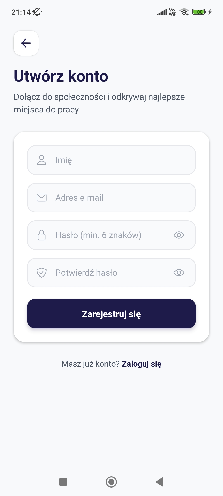 |

### Ekran główny — Mapa

| Widok mapy z markerami | Wyszukiwanie miejsc |
|:-----------------------:|:-------------------:|
| 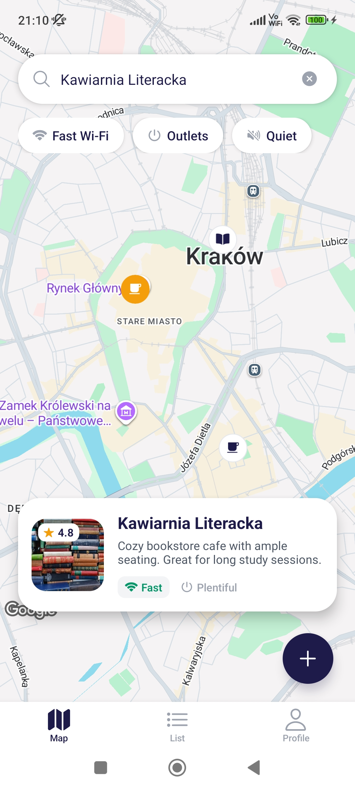 | 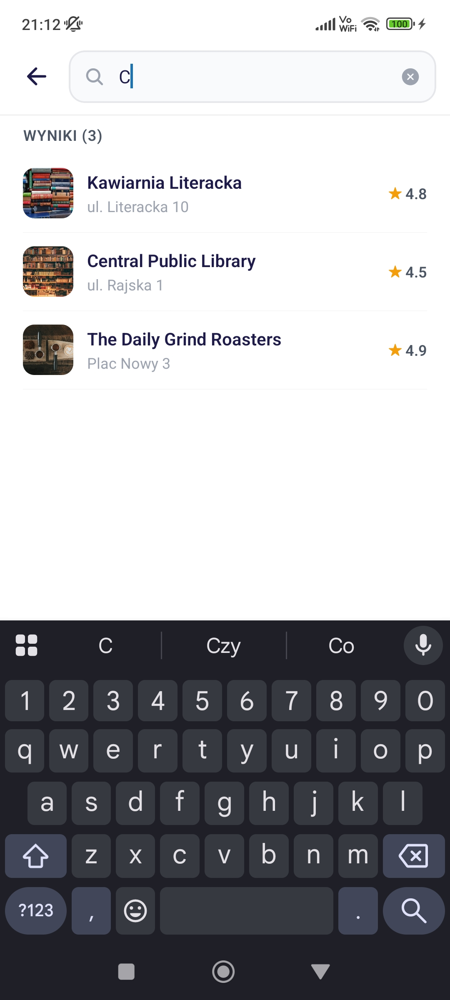 |

### Lista miejsc

| Lista z filtrami i kartami |
|:--------------------------:|
| 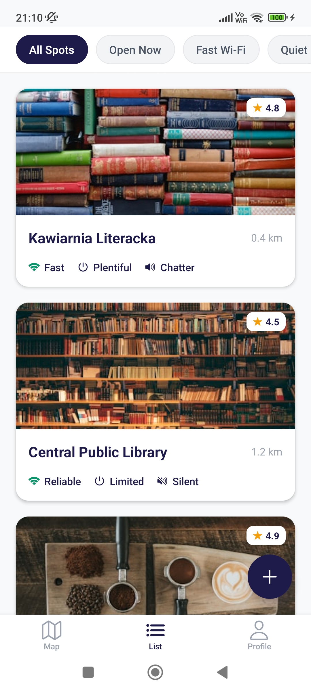 |

### Szczegóły miejsca

| Hero + Amenities | Lokalizacja + Recenzje | Dodawanie recenzji |
|:-----------------:|:----------------------:|:------------------:|
| 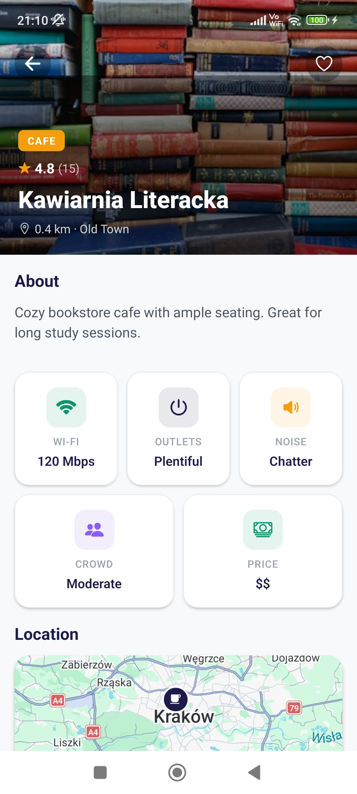 | 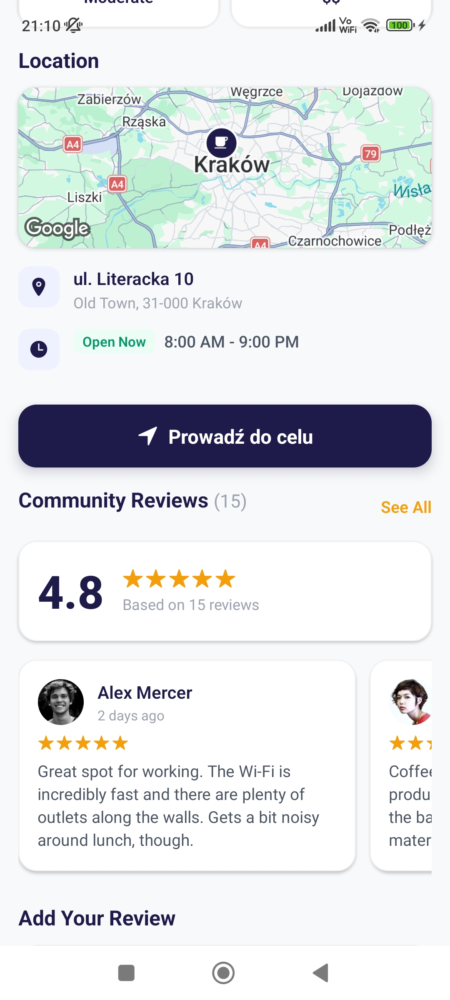 | 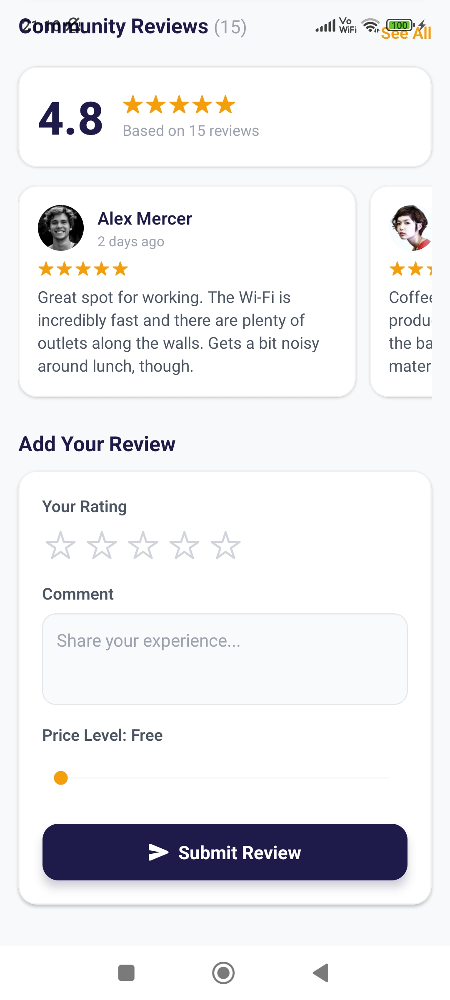 |

### Dodawanie nowego miejsca (formularz 3-krokowy)

| Krok 1 — Dane podstawowe | Krok 1 — Kategorie | Krok 2 — Udogodnienia | Krok 2 — Poziom cenowy | Krok 3 — Lokalizacja na mapie |
|:-------------------------:|:-------------------:|:---------------------:|:----------------------:|:-----------------------------:|
| 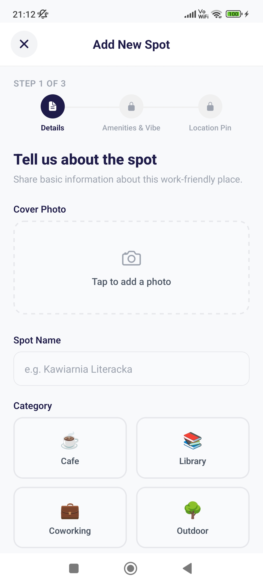 | 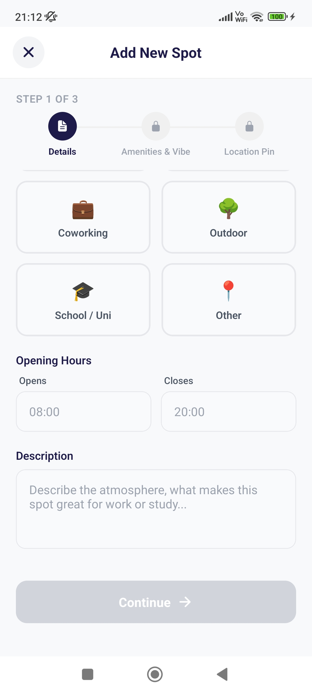 | 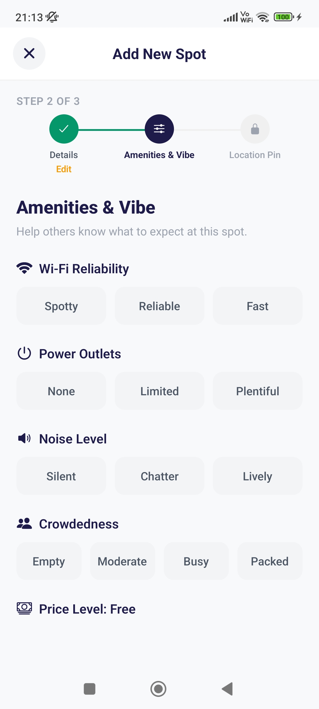 | 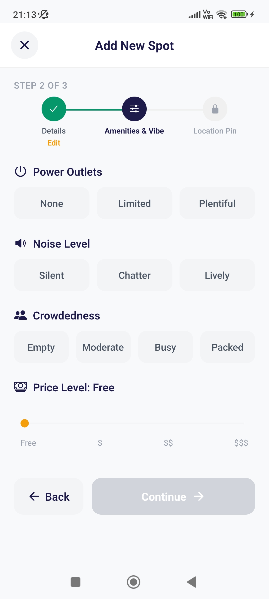 | 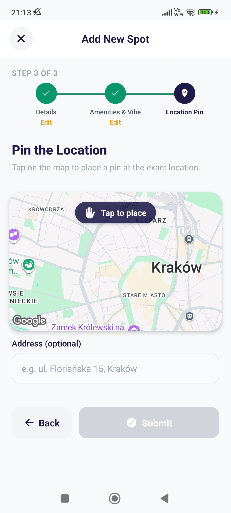 |

### Profil użytkownika

| Profil — statystyki i zapisane | Profil — ustawienia |
|:------------------------------:|:-------------------:|
| 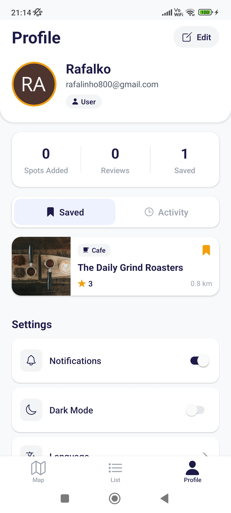 | 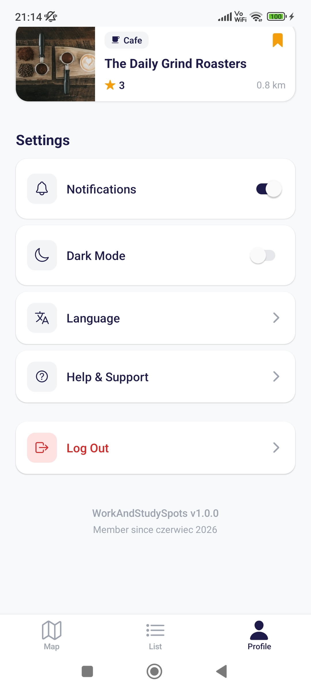 |

### Panel administratora

| Moderacja miejsc |
|:----------------:|
| 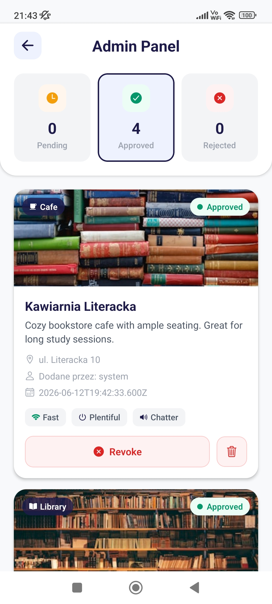 |

---

## Techniki projektowania frontendowego

### Design System

Projekt opiera się na spójnym **Design Systemie**, który definiuje kolory, typografię i style współdzielone przez cały zespół.

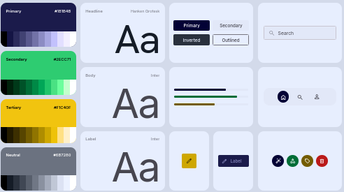

```javascript
// src/theme/colors.js — źródło prawdy dla kolorów
export const COLORS = {
  primary: '#1E1B4B',       // Ciemny granat — główny kolor
  accent: '#F59E0B',        // Złoty/Amber — akcent (rating, CTA)
  success: '#059669',       // Zielony — pozytywne stany
  danger: '#DC2626',        // Czerwony — błędy, usuwanie
  background: '#F8F9FA',    // Jasne tło
  // ...
};
```

### Zastosowane techniki

| Technika | Opis | Przykład w projekcie |
|----------|------|---------------------|
| **Komponentowa architektura UI** | Wydzielenie reużywalnych komponentów (`SpotCard`, `ReviewCard`, `RatingStars`, `AmenityBadge`) | `src/components/` |
| **Design Tokens** | Scentralizowana paleta kolorów i fontów w pliku `colors.js` — jeden punkt zmian dla całej aplikacji | `src/theme/colors.js` |
| **Dark Mode** | Pełna obsługa trybu ciemnego przez `ThemeContext` z oddzielną paletą `DARK_COLORS` | `src/context/ThemeContext.js` |
| **Formularz wielokrokowy (Wizard)** | Dodawanie miejsca podzielone na 3 kroki z progress barem i walidacją etapową | `AddSpotScreen.js` — Steps: Details → Amenities → Location |
| **Nawigacja warunkowa** | Rozdzielenie flow auth (Login/Register) od głównej aplikacji na podstawie stanu logowania | `App.js` — `isLoggedIn ? AppNavigator : AuthNavigator` |
| **Bottom Tabs + Stack Navigator** | Zagnieżdżona nawigacja: zakładki (Map / List / Profile) + ekrany szczegółowe w Stack | `AppNavigator.js` |
| **Hero Image z gradientem** | Zdjęcie na pełną szerokość z ciemnym gradientem overlay i białym tekstem na ekranie szczegółów | `SpotDetailScreen.js` |
| **Chip Filters** | Interaktywne filtry w formie chipów (All Spots, Open Now, Fast Wi-Fi, Quiet) | `ListScreen.js`, `MapScreen.js` |
| **Pill Buttons** | Przyciski opcji w formie pill (Spotty / Reliable / Fast) w formularzu dodawania | `AddSpotScreen.js` — Step 2 |
| **Interaktywna mapa** | Google Maps z markerami kategorii, kartą podglądu miejsca i pinowaniem lokalizacji | `MapScreen.js`, `AddSpotScreen.js` Step 3 |
| **Reactive State Management** | `AuthContext`, `ThemeContext`, `FavoritesContext` — React Context API do zarządzania stanem | `src/context/` |
| **Platform-aware styling** | Oddzielne komponenty mapy dla web (Leaflet) i natywnych (react-native-maps) | `MapViewComponent.web.js` vs `.native.js` |
| **StyleSheet.create()** | Wszystkie style definiowane przez React Native `StyleSheet` — bez inline styles | Każdy plik ekranu/komponentu |

---

## Struktura projektu

```
WorkAndStudySpots/
├── App.js                         # Punkt wejścia — providery + nawigacja warunkowa
├── app.json                       # Konfiguracja Expo
├── package.json                   # Zależności
├── assets/
│   └── screeny/                   # Zrzuty ekranu
│       ├── screeny_apka/          # Screeny z aplikacji
│       └── screeny firebase/      # Screeny z Firebase Analytics
├── src/
│   ├── components/                # Reużywalne komponenty UI
│   │   ├── AmenityBadge.js        #   Kafelek udogodnienia (Wi-Fi/Outlets/Noise)
│   │   ├── RatingStars.js         #   Gwiazdki oceny (display + interactive)
│   │   ├── ReviewCard.js          #   Karta recenzji
│   │   ├── WebLayoutShell.js      #   Shell layoutu webowego
│   │   ├── MapViewCompat.js       #   Kompatybilność map
│   │   ├── MapViewComponent.web.js    # Mapa Leaflet (web)
│   │   └── MapViewComponent.native.js # Mapa Google (native)
│   ├── screens/                   # Ekrany aplikacji
│   │   ├── LoginScreen.js         #   Logowanie
│   │   ├── RegisterScreen.js      #   Rejestracja
│   │   ├── MapScreen.js           #   Mapa z markerami
│   │   ├── ListScreen.js          #   Lista miejsc z filtrami
│   │   ├── SpotDetailScreen.js    #   Szczegóły miejsca
│   │   ├── AddSpotScreen.js       #   Formularz dodawania (3 kroki)
│   │   ├── ProfileScreen.js       #   Profil użytkownika
│   │   └── AdminPanelScreen.js    #   Panel administracyjny
│   ├── navigation/                # Konfiguracja nawigacji
│   │   ├── AppNavigator.js        #   Stack + Bottom Tabs
│   │   └── AuthNavigator.js       #   Stack logowania
│   ├── context/                   # React Context (stan globalny)
│   │   ├── AuthContext.js         #   Autentykacja użytkownika
│   │   ├── ThemeContext.js        #   Tryb jasny / ciemny
│   │   └── FavoritesContext.js    #   Ulubione miejsca
│   ├── services/                  # Komunikacja z backendem
│   │   ├── firebase.js            #   Konfiguracja Firebase
│   │   ├── authService.js         #   Login, register, logout
│   │   ├── spotsService.js        #   CRUD miejsc (Firestore)
│   │   ├── reviewsService.js      #   CRUD recenzji
│   │   └── searchHistoryService.js#   Historia wyszukiwania
│   ├── theme/                     # System designu
│   │   ├── colors.js              #   Paleta kolorów (light + dark)
│   │   └── mapStyles.js           #   Style mapy
│   ├── constants/                 # Stałe
│   │   ├── categories.js          #   Kategorie miejsc
│   │   └── spotOptions.js         #   Opcje filtrów
│   └── utils/                     # Funkcje pomocnicze
│       ├── filters.js             #   Logika filtrowania
│       └── formatters.js          #   Formatowanie danych
```

---

## Podział ról w zespole

| Osoba | Rola | Zakres odpowiedzialności |
|-------|------|--------------------------|
| **Łukasz** | Backend & Autentykacja | Konfiguracja Firebase (Auth + Firestore), serwisy danych (`authService`, `spotsService`, `reviewsService`), `AuthContext`, ekrany logowania i rejestracji, `AuthNavigator` |
| **Rafał** | Ekrany miejsc & Komponenty | Ekran szczegółów miejsca (`SpotDetailScreen`), formularz dodawania (`AddSpotScreen` — 3 kroki), komponenty współdzielone (`ReviewCard`, `RatingStars`, `AmenityBadge`) |
| **Jakub** | Nawigacja & Panele | Panel użytkownika (`ProfileScreen`), panel admina (`AdminPanelScreen`), integracja nawigacji (`AppNavigator` — Stack + Tabs), złożenie `App.js`, design system (`colors.js`), `ThemeContext`, `FavoritesContext` |

---

## Firebase Analytics

Aplikacja jest wdrożona na **Netlify** (wersja webowa) i monitorowana przez **Google Analytics for Firebase**.

| Aktywność użytkowników | Średni czas zaangażowania |
|:----------------------:|:-------------------------:|
|  |  |

| Pozyskiwanie użytkowników | Zdarzenia |
|:-------------------------:|:---------:|
|  |  |

| Użytkownicy wg kraju | Użytkownicy wg języka | Mapa geograficzna |
|:---------------------:|:----------------------:|:-----------------:|
|  |  |  |

| Hosting — Netlify | Zdarzenia Firebase |
|:-----------------:|:------------------:|
|  |  |

---

## Hotjar Analytics

Aplikacja jest również zintegrowana z narzędziem **Hotjar** w celu analizy zachowań użytkowników (m.in. heatmaps, nagrania sesji).

| Panel Hotjar 1 | Panel Hotjar 2 | Panel Hotjar 3 |
|:--------------:|:--------------:|:--------------:|
| 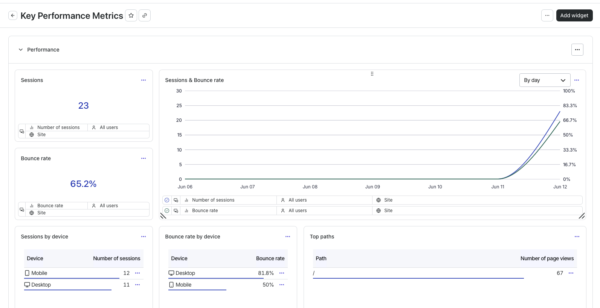 | 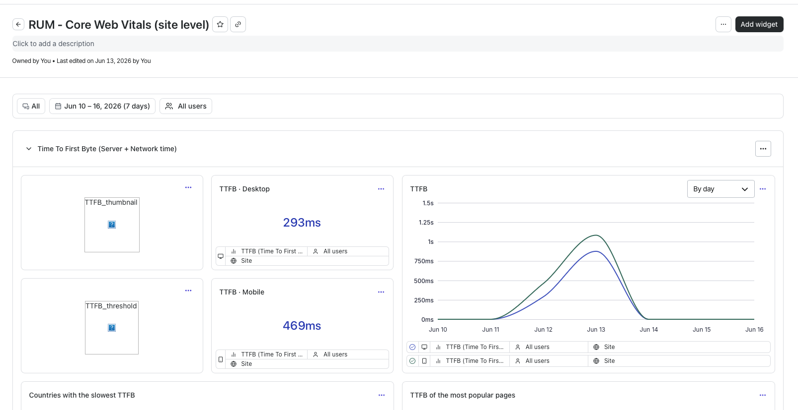 | 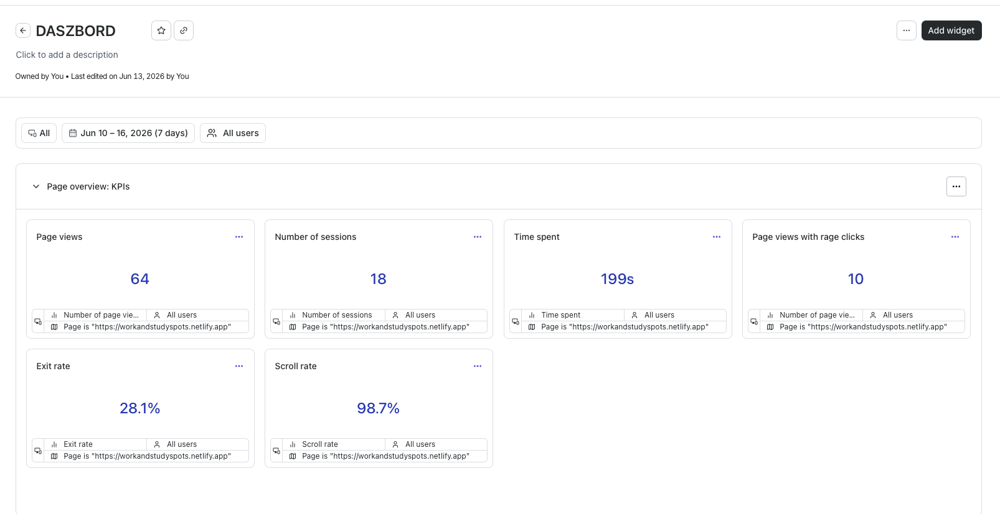 |

---

## Instrukcja uruchomienia

### Wymagania

- **Node.js** ≥ 18
- **npm** ≥ 9
- **Expo CLI** (`npx expo`)

### Instalacja i uruchomienie

```bash
# 1. Klonowanie repozytorium
git clone https://github.com/JakubW99/WorkAndStudySpots.git
cd WorkAndStudySpots

# 2. Instalacja zależności
npm install

# 3. Uruchomienie aplikacji
npx expo start
```

Po uruchomieniu dostępne opcje:
- **`w`** — otwórz wersję webową w przeglądarce
- **`a`** — otwórz na urządzeniu Android / emulatorze
- **`i`** — otwórz na urządzeniu iOS / symulatorze
- **Expo Go** — zeskanuj kod QR aplikacją Expo Go na telefonie

### Konfiguracja Firebase

Plik `.env` z konfiguracją Firebase jest wymagany do działania backendu (autentykacja, baza danych). Skontaktuj się z zespołem w celu uzyskania danych konfiguracyjnych.

---

## Technologie

| Technologia | Wersja | Zastosowanie |
|-------------|--------|-------------|
| React Native | 0.81.5 | Framework mobilny |
| Expo SDK | 54 | Tooling i budowanie |
| Firebase | 12.14 | Auth + Firestore + Analytics |
| React Navigation | 7.x | Nawigacja (Stack + Bottom Tabs) |
| React Native Maps | 1.20.1 | Mapy Google (native) |
| Leaflet / React-Leaflet | 1.9 / 5.0 | Mapy (wersja webowa) |
| Netlify | — | Hosting wersji webowej |
