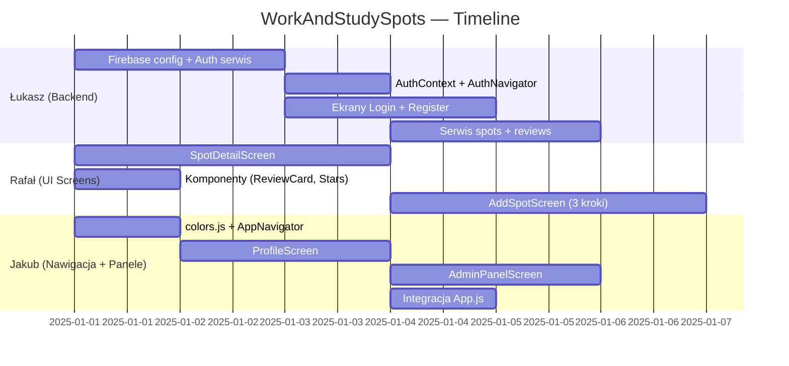

# WorkAndStudySpots — Podział ról w zespole

## 📋 Podsumowanie projektu

**WorkAndStudySpots** — aplikacja mobilna (React Native / Expo SDK 54) pomagająca użytkownikom znajdować najlepsze miejsca do pracy i nauki (kawiarnie, biblioteki, co-workingi). Użytkownicy mogą przeglądać miejsca na mapie i liście, filtrować je po parametrach (Wi-Fi, gniazdka, hałas), dodawać nowe miejsca i pisać recenzje.

### Co już jest zrobione ✅
| Element | Status | Plik |
|---------|--------|------|
| Projekt Expo + nawigacja (Bottom Tabs) | ✅ | `App.js` |
| Ekran mapy z markerami + bottom card | ✅ | `src/screens/MapScreen.js` |
| Ekran listy z kartami miejsc + filtry | ✅ | `src/screens/ListScreen.js` |
| Dane tymczasowe (hardcoded `DUMMY_SPOTS`) | ✅ | wewnątrz ekranów |
| Profil (zaślepka `null`) | 🔲 | `App.js` linia 13 |

### Co trzeba zrobić 🔲
| Funkcjonalność | Priorytet | Przypisanie |
|----------------|-----------|-------------|
| Backend (Firebase/Supabase) + modele danych | 🔴 Krytyczny | **Łukasz** |
| Logowanie i rejestracja (Auth) | 🔴 Krytyczny | **Łukasz** |
| Ekran szczegółów miejsca (SpotDetailScreen) | 🟡 Wysoki | **Rafał** |
| Formularz dodawania miejsc (AddSpotScreen) | 🟡 Wysoki | **Rafał** |
| Panel użytkownika (ProfileScreen) | 🟠 Średni | **Jakub (Ty)** |
| Panel admina (AdminPanelScreen) | 🟠 Średni | **Jakub (Ty)** |
| Integracja nawigacji (Stack + Tabs) | 🟡 Wysoki | **Jakub (Ty)** |

---

## 🏗️ Architektura docelowa

```
src/
├── components/           # Wspólne komponenty UI
│   ├── SpotCard.js
│   ├── FilterChip.js
│   ├── RatingStars.js
│   ├── ReviewCard.js
│   └── LoadingSpinner.js
├── screens/
│   ├── MapScreen.js          ✅ (istniejący)
│   ├── ListScreen.js         ✅ (istniejący)
│   ├── SpotDetailScreen.js   🔲 Rafał
│   ├── AddSpotScreen.js      🔲 Rafał
│   ├── LoginScreen.js        🔲 Łukasz
│   ├── RegisterScreen.js     🔲 Łukasz
│   ├── ProfileScreen.js      🔲 Jakub
│   └── AdminPanelScreen.js   🔲 Jakub
├── navigation/
│   ├── AppNavigator.js       🔲 Jakub (Stack + Tabs)
│   └── AuthNavigator.js      🔲 Łukasz
├── services/
│   ├── firebase.js           🔲 Łukasz (konfiguracja)
│   ├── authService.js        🔲 Łukasz
│   ├── spotsService.js       🔲 Łukasz
│   └── reviewsService.js     🔲 Łukasz
├── context/
│   └── AuthContext.js        🔲 Łukasz
├── theme/
│   └── colors.js             🔲 Wspólne
└── utils/
    └── helpers.js            🔲 Wspólne
```

---

## 🎨 Design System (wspólne wytyczne)

Wszyscy muszą stosować te same kolory i style:

```javascript
// src/theme/colors.js
export const COLORS = {
  primary: '#1E1B4B',       // Ciemny granat — główny kolor
  accent: '#F59E0B',        // Złoty/Amber — akcent (rating, CTA)
  accentHover: '#FBBF24',   // Jaśniejszy amber
  success: '#059669',       // Zielony — Wi-Fi, pozytywne
  background: '#F8F9FA',    // Jasne tło
  white: '#FFFFFF',
  textPrimary: '#1E1B4B',
  textSecondary: '#4B5563',
  textMuted: '#9CA3AF',
  border: '#E5E7EB',
  cardShadow: '#000',
};

export const FONTS = {
  bold: { fontWeight: '700' },
  semiBold: { fontWeight: '600' },
  medium: { fontWeight: '500' },
  regular: { fontWeight: '400' },
};
```

---

## 🔥 Model danych (Firebase Firestore)

```
users/
  {userId}/
    - email: string
    - displayName: string
    - avatarUrl: string
    - role: 'user' | 'admin'
    - createdAt: timestamp
    - spotsAdded: number
    - reviewsCount: number

spots/
  {spotId}/
    - name: string
    - description: string
    - category: 'cafe' | 'library' | 'coworking'
    - latitude: number
    - longitude: number
    - address: string
    - district: string
    - imageUrl: string
    - rating: number (obliczane)
    - wifi: 'Spotty' | 'Reliable' | 'Fast'
    - wifiSpeed: number (Mbps)
    - outlets: 'None' | 'Limited' | 'Plentiful'
    - noise: 'Silent' | 'Chatter' | 'Lively' | 'Loud'
    - openingHours: { open: string, close: string }
    - addedBy: userId
    - status: 'pending' | 'approved' | 'rejected'
    - createdAt: timestamp

reviews/
  {reviewId}/
    - spotId: string
    - userId: string
    - userName: string
    - rating: number (1-5)
    - comment: string
    - createdAt: timestamp

savedSpots/
  {userId}/
    - spotIds: string[]
```

---

# 👤 OSOBA A — Backend & Autentykacja

## Zakres odpowiedzialności
- Konfiguracja Firebase (Auth + Firestore + Storage)
- Ekrany logowania i rejestracji
- Serwisy do komunikacji z bazą (CRUD)
- AuthContext (zarządzanie stanem logowania)
- AuthNavigator (przekierowanie zalogowany/niezalogowany)

## Pliki do stworzenia
| Plik | Opis |
|------|------|
| `src/services/firebase.js` | Inicjalizacja Firebase |
| `src/services/authService.js` | Login, register, logout, resetPassword |
| `src/services/spotsService.js` | getSpots, addSpot, updateSpot, deleteSpot, getSpotById |
| `src/services/reviewsService.js` | addReview, getReviewsForSpot, deleteReview |
| `src/context/AuthContext.js` | React Context z useAuth hook |
| `src/screens/LoginScreen.js` | Ekran logowania |
| `src/screens/RegisterScreen.js` | Ekran rejestracji |
| `src/navigation/AuthNavigator.js` | Stack Navigator (Login → Register) |

## Zależności do doinstalowania
```bash
npx expo install firebase
# lub alternatywnie:
npx expo install @react-native-firebase/app @react-native-firebase/auth @react-native-firebase/firestore
```

---

### 🤖 PROMPT DLA AGENTA — OSOBA A

```
Pracujesz nad aplikacją mobilną "WorkAndStudySpots" w React Native (Expo SDK 54).
Projekt używa: react-navigation (Bottom Tabs + Stack), react-native-maps, Ionicons.

TWOJE ZADANIE: Zbuduj warstwę backendową (Firebase) oraz ekrany autentykacji.

## KONTEKST PROJEKTU
- Aplikacja pozwala użytkownikom znajdować miejsca do pracy/nauki (kawiarnie, biblioteki)
- Już istnieją ekrany: MapScreen.js (mapa z markerami) i ListScreen.js (lista kart)
- Oba ekrany używają obecnie hardcoded DUMMY_SPOTS — Twoje serwisy je zastąpią
- Nawigacja: Bottom Tabs (Map | List | Profile) — istniejący plik App.js
- Kolory projektu: primary=#1E1B4B, accent=#F59E0B, success=#059669, bg=#F8F9FA

## CO MUSISZ ZROBIĆ (kolejność):

### 1. Konfiguracja Firebase (`src/services/firebase.js`)
- Zainicjalizuj Firebase z konfiguracją projektu
- Wyeksportuj instancje: auth, db (Firestore), storage

### 2. Serwis autentykacji (`src/services/authService.js`)
Eksportuj funkcje:
- signUp(email, password, displayName) — tworzy konto + dokument w users/
- signIn(email, password)
- signOut()
- resetPassword(email)
- Nowi użytkownicy mają domyślnie role: 'user'

### 3. AuthContext (`src/context/AuthContext.js`)
- React Context + Provider
- Hook useAuth() zwraca: { user, isLoading, isLoggedIn, userRole }
- onAuthStateChanged listener przy mount
- Pobierz dane usera z Firestore (w tym role) po zalogowaniu

### 4. Serwis miejsc (`src/services/spotsService.js`)
Kolekcja Firestore: "spots"
- getAllSpots() — pobierz wszystkie ze statusem 'approved'
- getSpotById(id)
- addSpot(spotData, userId) — dodaj nowe miejsce ze statusem 'pending'
- updateSpotStatus(spotId, status) — dla admina (approved/rejected)
- deleteSpot(spotId) — dla admina

Schemat dokumentu spot:
{
  name, description, category ('cafe'|'library'|'coworking'),
  latitude, longitude, address, district,
  imageUrl, rating (number),
  wifi ('Spotty'|'Reliable'|'Fast'), wifiSpeed (number),
  outlets ('None'|'Limited'|'Plentiful'),
  noise ('Silent'|'Chatter'|'Lively'|'Loud'),
  openingHours: { open, close },
  addedBy (userId), status ('pending'|'approved'|'rejected'),
  createdAt (serverTimestamp)
}

### 5. Serwis recenzji (`src/services/reviewsService.js`)
Kolekcja Firestore: "reviews"
- addReview(spotId, userId, userName, rating, comment)
- getReviewsForSpot(spotId) — posortowane od najnowszych
- deleteReview(reviewId)
Po dodaniu recenzji — przelicz średnią ocenę spotu.

### 6. Ekran logowania (`src/screens/LoginScreen.js`)
UI zgodne z designem aplikacji:
- Logo/Tytuł "WorkStudy" na górze
- Pola: Email, Hasło
- Przycisk "Zaloguj się" (kolor primary #1E1B4B)
- Link "Nie masz konta? Zarejestruj się"
- Link "Zapomniałeś hasła?"
- Obsługa błędów (wyświetl komunikat)
- Loading state na przycisku

### 7. Ekran rejestracji (`src/screens/RegisterScreen.js`)
- Pola: Imię, Email, Hasło, Potwierdź hasło
- Walidacja (email format, hasło min 6 znaków, hasła się zgadzają)
- Przycisk "Zarejestruj się"
- Link "Masz już konto? Zaloguj się"

### 8. AuthNavigator (`src/navigation/AuthNavigator.js`)
- Stack Navigator z ekranami: Login, Register
- Bez headera (headerShown: false)

## STYL KODU
- Używaj StyleSheet.create() — nie inline styles
- Kolory z palety: primary=#1E1B4B, accent=#F59E0B, success=#059669
- Ikonki: @expo/vector-icons (Ionicons)
- Komentarze po polsku

## WAŻNE
- NIE modyfikuj istniejących plików (MapScreen.js, ListScreen.js, App.js)
- Twórz TYLKO nowe pliki w odpowiednich folderach
- Eksportuj wszystko czytelnie — reszta zespołu będzie importować Twoje serwisy
- Upewnij się, że AuthContext.Provider opakowuje całą aplikację (ale to zmieni Jakub w App.js)
```

---

# 🖼️ OSOBA B — Ekran szczegółów + Dodawanie miejsc

## Zakres odpowiedzialności
- Ekran szczegółów miejsca (SpotDetailScreen) — pełny widok z recenzjami
- Formularz wielokrokowy dodawania miejsc (AddSpotScreen)
- Komponenty współdzielone (ReviewCard, RatingStars)

## Pliki do stworzenia
| Plik | Opis |
|------|------|
| `src/screens/SpotDetailScreen.js` | Pełny widok miejsca (zdjęcie, dane, mapa, recenzje) |
| `src/screens/AddSpotScreen.js` | Formularz 3-krokowy dodawania |
| `src/components/ReviewCard.js` | Karta recenzji (avatar, imię, ocena, tekst) |
| `src/components/RatingStars.js` | Komponent gwiazdek (wyświetlanie + input) |
| `src/components/AmenityBadge.js` | Kafelek z ikoną (Wi-Fi/Outlets/Noise) |

## Referencje wizualne
- **SpotDetailScreen**: Wzór na screenie 3 (zdjęcie hero, kafelki Wi-Fi/Outlets/Noise, mini-mapa, adres, godziny, recenzje, przycisk "Prowadź do celu")
- **AddSpotScreen**: Wzór na screenie 4 (multi-step: Step 1 Details → Step 2 Amenities → Step 3 Location Pin)

---

### 🤖 PROMPT DLA AGENTA — OSOBA B

```
Pracujesz nad aplikacją mobilną "WorkAndStudySpots" w React Native (Expo SDK 54).
Projekt używa: react-navigation, react-native-maps, Ionicons (@expo/vector-icons).

TWOJE ZADANIE: Stwórz ekran szczegółów miejsca i formularz dodawania nowych miejsc.

## KONTEKST PROJEKTU
- Aplikacja do znajdowania miejsc do pracy/nauki (kawiarnie, biblioteki, co-workingi)
- Istniejące ekrany: MapScreen.js (mapa) i ListScreen.js (lista) — NIE MODYFIKUJ ICH
- Z tych ekranów będzie nawigacja do Twojego SpotDetailScreen (parametr: spotId)
- Kolory: primary=#1E1B4B, accent=#F59E0B, success=#059669, bg=#F8F9FA
- Inna osoba (Łukasz) buduje serwisy Firebase — na razie użyj DUMMY DATA

## CO MUSISZ ZROBIĆ:

### 1. SpotDetailScreen (`src/screens/SpotDetailScreen.js`)

Pełnoekranowy widok szczegółów miejsca. Layout (od góry):

**A) Hero Image (górna część)**
- Zdjęcie na pełną szerokość, wysokość ~250px
- Na zdjęciu overlay z gradientem od dołu (ciemny)
- Na overlayie: badge kategorii (np. "CAFE"), ocena (★ 4.8)
- Nazwa miejsca (duży biały tekst, bold)
- Odległość + Dzielnica pod nazwą
- Przycisk "Wstecz" (strzałka) w lewym górnym rogu

**B) Kafelki amenities (3 kolumny)**
Trzy zaokrąglone kafelki obok siebie:
- Wi-Fi: ikona wifi, wartość "50 Mbps" 
- Outlets: ikona power, wartość "Available"
- Noise: ikona volume, wartość "Moderate"
Każdy kafelek: białe tło, zaokrąglone rogi, cień, ikona na górze (kolor primary), wartość pod spodem

**C) Sekcja lokalizacji**
- Mini mapa (MapView, height: 120, zaokrąglone rogi, nieinteraktywna z markerem)
- Pod mapą: Adres (ikona pin + tekst)
- Godziny otwarcia (ikona zegar + "Open Now" badge zielony + godziny)

**D) Sekcja recenzji ("Community Reviews")**
- Nagłówek "Community Reviews" + "(124)" + link "See All"
- Lista ReviewCard (2-3 karty)
- Każda ReviewCard: avatar, imię, "X days ago", gwiazdki, tekst recenzji

**E) Przycisk CTA na dole**
- Fixed button na dole: "◆ Prowadź do celu"
- Kolor: primary (#1E1B4B), tekst biały, pełna szerokość z marginesami
- Border radius: 16px

DANE TYMCZASOWE (do zastąpienia przez serwisy Firebase):
const DUMMY_DETAIL = {
  id: '1',
  name: 'The Grindhouse Roasters',
  category: 'cafe',
  rating: 4.8,
  distance: '0.8 km',
  district: 'Downtown District',
  imageUrl: 'https://images.unsplash.com/photo-1554118811-1e0d58224f24?q=80&w=600',
  wifiSpeed: 50,
  outlets: 'Available',
  noise: 'Moderate',
  address: '123 Espresso Lane',
  addressFull: 'Downtown District, Cityville 90210',
  openNow: true,
  hours: '7:00 AM - 8:00 PM',
  reviews: [
    { id: 'r1', userName: 'Alex Mercer', timeAgo: '2 days ago', rating: 5,
      comment: 'Great spot for working. The Wi-Fi is incredibly fast and there are plenty of outlets along the walls. Gets a bit noisy around lunch, though.',
      avatarUrl: 'https://i.pravatar.cc/100?img=12' },
    { id: 'r2', userName: 'Sarah Jenkins', timeAgo: '1 week ago', rating: 4,
      comment: 'Coffee is decent, atmosphere is very productive. I love the large tables in the back for spreading out my study materials.',
      avatarUrl: 'https://i.pravatar.cc/100?img=25' }
  ]
};

### 2. AddSpotScreen (`src/screens/AddSpotScreen.js`)

Formularz wielokrokowy (3 kroki) z progress barem na górze.

**Progress Bar:**
- Na górze ekranu: "Step X of 3" + nazwa kroku
- Pasek postępu (kolorowy dla ukończonych, szary dla pozostałych)

**Step 1: Details (Dane podstawowe)**
- Nazwa miejsca (TextInput)
- Kategoria (3 przyciski do wyboru: Cafe ☕ | Library 📚 | Coworking 💼)
- Opis (TextInput multiline)
- Po wypełnieniu: przycisk "Continue →"

**Step 2: Amenities & Vibe (Udogodnienia)**
- Wi-Fi Reliability: 3 opcje do wyboru (Spotty | Reliable | Fast) — pill buttons
- Power Outlets: 3 opcje (None | Limited | Plentiful)  
- Noise Level: 3 opcje (Silent | Chatter | Lively)
- Każda grupa opcji: ikona + nazwa + 3 przyciski obok siebie
- Aktywna opcja: kolor primary, tekst primary; nieaktywna: szare tło
- Przyciski: "Back" (tekst) i "Continue →" (wypełniony)

**Step 3: Location Pin (Lokalizacja)**
- MapView na pełny ekran z możliwością postawienia pina
- Instrukcja: "Tap on the map to place a pin"
- Pole adresu (opcjonalne, TextInput)
- Przyciski: "Back" i "Submit" (zielony/primary)

**Po submicie:**
- Wyświetl ekran sukcesu lub alert
- Dane zbierane z formularza (na razie console.log, potem podpięcie do spotsService.addSpot)

**Ważne detale UI:**
- Ukończone kroki: zielona ikonka ✓ + "Edit" link
- Kroki w przyszłości: zablokowane (szare, ikona kłódki)
- Animacja przejścia między krokami (opcjonalnie)
- Przycisk "×" w lewym górnym rogu do zamknięcia

### 3. Komponent ReviewCard (`src/components/ReviewCard.js`)
Props: { userName, timeAgo, rating, comment, avatarUrl }
- Okrągły avatar (40x40)
- Imię (bold) + timeAgo (szary, mniejszy)
- Gwiazdki (wypełnione złote + puste szare)
- Tekst recenzji

### 4. Komponent RatingStars (`src/components/RatingStars.js`)
Props: { rating, size, interactive, onRate }
- Tryb display: wyświetla gwiazdki (złote ★ + szare ☆)
- Tryb interactive (interactive=true): klikalne gwiazdki, wywołuje onRate(value)

### 5. Komponent AmenityBadge (`src/components/AmenityBadge.js`)
Props: { icon, label, value, color }
- Kafelek: ikona na górze, label pod spodem, wartość na dole
- Zaokrąglone rogi, cień, biały background

## STYL KODU
- StyleSheet.create() — NIE inline styles
- Kolory: primary=#1E1B4B, accent=#F59E0B, success=#059669, bg=#F8F9FA, white=#FFF
- Ikonki: Ionicons z @expo/vector-icons
- Komentarze po polsku
- Komponent eksportowany jako default

## NAWIGACJA
- SpotDetailScreen otrzyma parametr `spotId` przez route.params
  (const { spotId } = route.params;)
- AddSpotScreen będzie prezentowany jako modal (Stack.Screen z presentation: 'modal')
- Oba ekrany: headerShown: false (własny header w komponencie)

## WAŻNE
- NIE modyfikuj istniejących plików
- Na razie użyj DUMMY DATA — serwisy Firebase zrobi Łukasz
- Zadbaj o ScrollView tam gdzie treść może przekroczyć ekran
- Zadbaj o SafeAreaView na iOS
- Przetestuj na różnych rozmiarach ekranu
```

---

# 🛠️ OSOBA C (TY) — Panel użytkownika, Panel admina, Nawigacja

## Zakres odpowiedzialności
- ProfileScreen — pełny panel użytkownika
- AdminPanelScreen — panel moderacji
- Integracja nawigacji (Stack + Tabs + Auth flow)
- Złożenie całej aplikacji (App.js)

## Pliki do stworzenia / zmodyfikowania
| Plik | Opis |
|------|------|
| `src/screens/ProfileScreen.js` | Panel użytkownika (zapisane, aktywność, ustawienia) |
| `src/screens/AdminPanelScreen.js` | Panel admina (moderacja miejsc, użytkownicy) |
| `src/navigation/AppNavigator.js` | Główna nawigacja (Tabs + Stack) |
| `App.js` | **MODYFIKACJA** — dodanie AuthContext + nawigacja warunkowa |
| `src/theme/colors.js` | Wspólna paleta kolorów |

## Referencje wizualne
- **ProfileScreen**: Wzór na screenie 5 (avatar, statystyki, Saved/Activity tabs, ustawienia)
- **AdminPanelScreen**: Brak screena — zaprojektuj sam (lista pending spotów + approve/reject)

---

# 📅 Kolejność pracy i zależności



### Zależności między osobami
1. **Rafał i C** mogą zacząć pracę równolegle z **Osobą A** — używają dummy data
2. **Jakub** potrzebuje `AuthContext` od Osoby A do integracji w `App.js`
3. **Rafał** potrzebuje `spotsService` i `reviewsService` od Osoby A do podpięcia danych
4. Po zakończeniu pracy osobnej — **Jakub** robi finalne złożenie nawigacji

### Konwencja commitów Git
```
feat(auth): add login screen — Łukasz
feat(spots): add detail screen — Rafał  
feat(nav): integrate stack navigator — Jakub
fix(auth): handle email validation — Łukasz
```

### Branche
```
main              ← stabilna wersja
├── feature/auth          ← Łukasz
├── feature/spot-screens  ← Rafał
└── feature/panels-nav    ← Jakub (Ty)
```

---

# ⚠️ Zasady współpracy

1. **NIE modyfikuj plików innych osób** — jeśli potrzebujesz zmian, napisz w grupie
2. **Używaj tych samych kolorów** — plik `src/theme/colors.js` jest źródłem prawdy
3. **Eksportuj wszystko z named exports** lub default export — bądź konsekwentny
4. **Dummy data** — na razie hardcodowane dane, potem podpięcie do Firebase
5. **Testuj na iOS i Android** — `npx expo start` → otwórz na obu platformach
6. **Merge do main** — dopiero po code review przez inną osobę z zespołu
